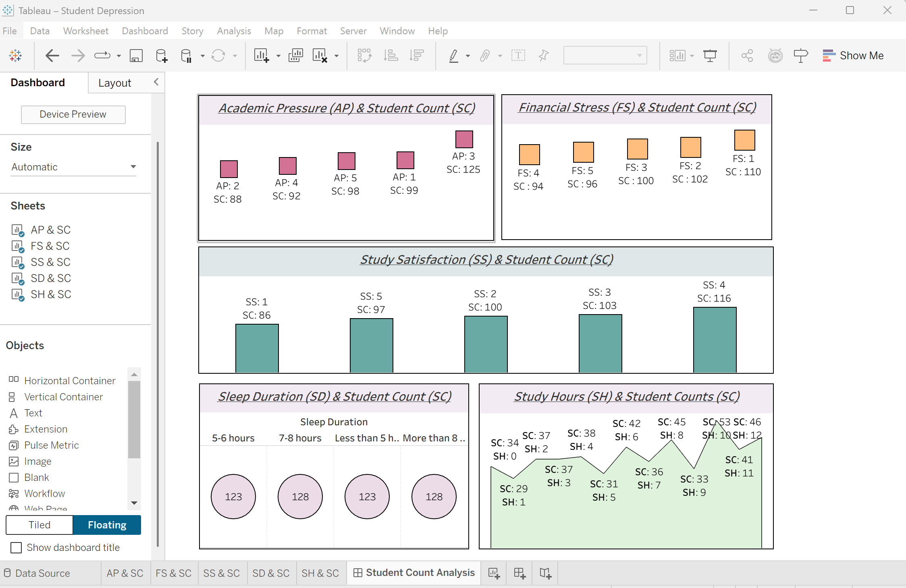
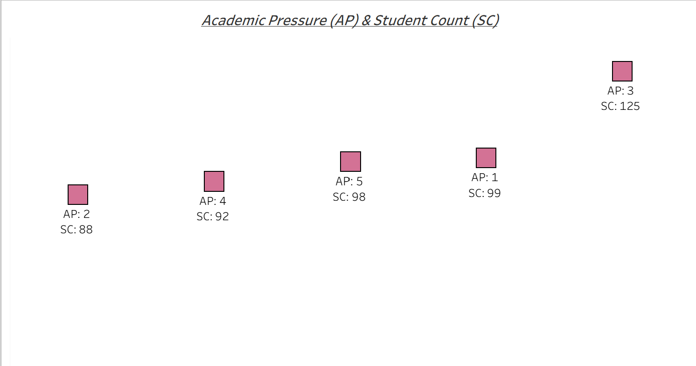
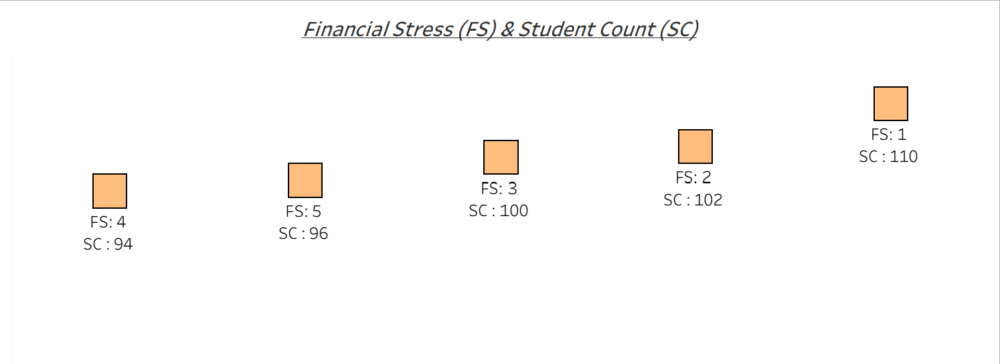
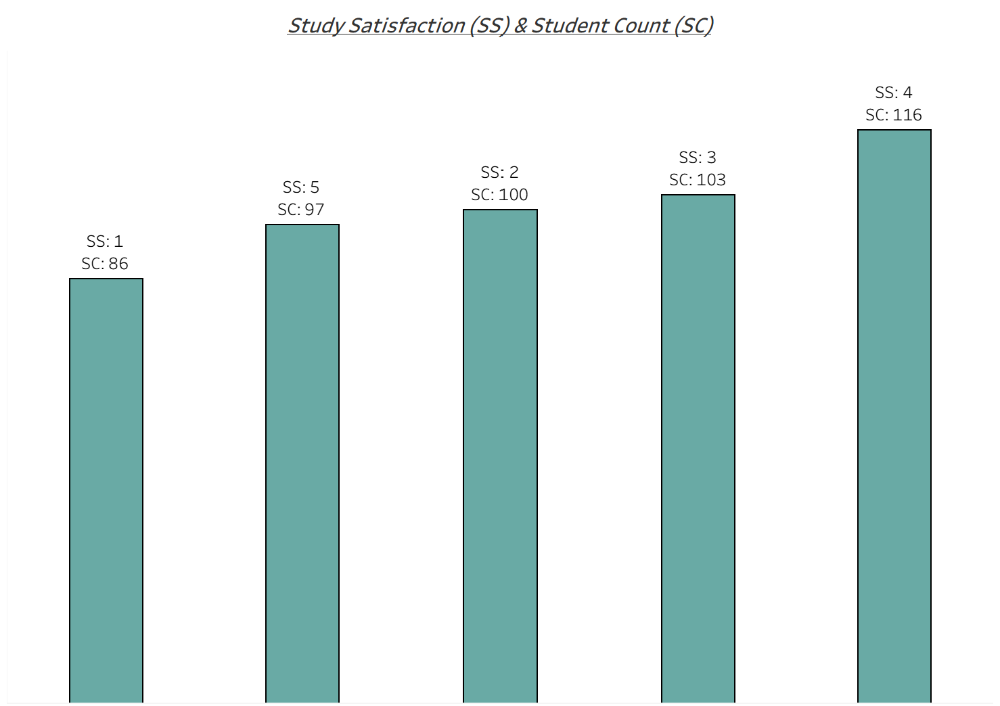
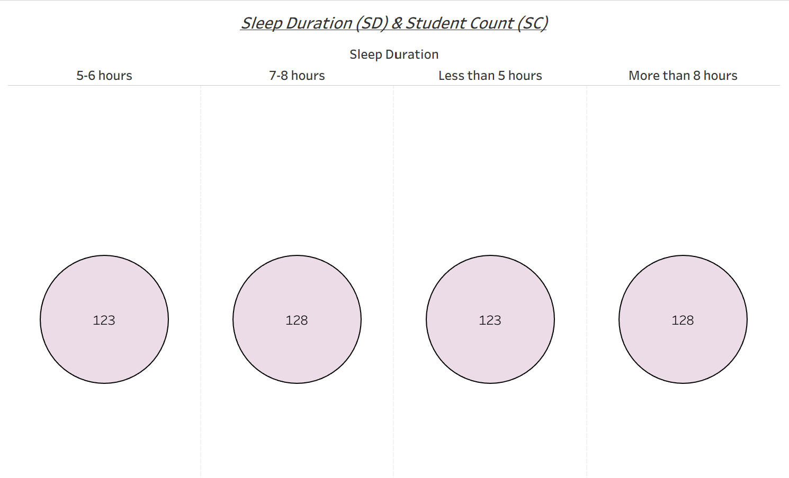
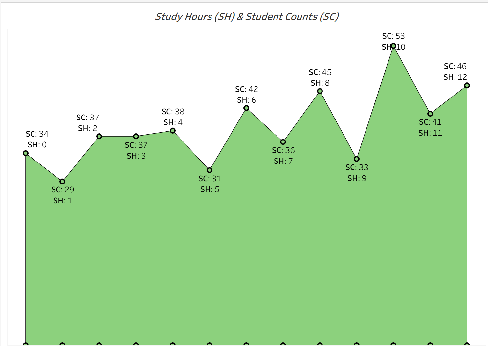

# 🎓 Student Depression Analytics using SQL & Tableau

> An end-to-end data analytics project exploring the relationship between academic, financial, lifestyle, and psychological factors associated with student depression. This project demonstrates SQL-based data analysis and interactive Tableau dashboards to generate actionable insights that support evidence-based decision-making.

---

# 📖 Project Overview

Student depression is a growing global concern influenced by academic, financial, social, and lifestyle factors. This project performs exploratory data analysis using SQL and visualizes key findings through Tableau dashboards to identify meaningful trends associated with student mental health.

The project demonstrates an end-to-end analytics workflow, from raw data exploration to interactive business intelligence dashboards, highlighting practical skills in SQL, Tableau, Git, and GitHub.

---

# 🎯 Objectives

- Clean and prepare raw data using SQL.
- Perform exploratory data analysis (EDA).
- Investigate factors associated with student depression.
- Develop interactive Tableau dashboards.
- Communicate insights through data visualization and reporting.

---

# 🛠 Technology Stack

| Technology | Purpose |
|------------|---------|
| SQL | Data Cleaning & Exploratory Analysis |
| Tableau | Dashboard Development & Visualization |
| Git | Version Control |
| GitHub | Project Documentation & Portfolio |

---

# 📂 Repository Structure

```text
Student_Depression_Analytics/
│
├── README.md
│
├── data/
│   └── Depression+Student+Dataset.csv
│
├── sql/
│   ├── SQLQuery1.sql
│   ├── SQLQuery2.sql
│   ├── SQLQuery3.sql
│   └── SQLQuery4.sql
│
├── tableau/
│   ├── student_depression.twb
│   └── student_depression.twbx
│
├── dashboard/
│   ├── dashboard_overview.png
│   ├── academic_pressure.png
│   ├── financial_stress.png
│   ├── study_satisfaction.png
│   ├── sleep_duration.png
│   └── study_hours.png
│
└── docs/
    ├── report.pdf
```

---

# 🔄 Project Workflow

```text
                   Student Depression Dataset
                              │
                              ▼
                  SQL Data Cleaning & Validation
                              │
                              ▼
               Exploratory Data Analysis (EDA)
                              │
                              ▼
                 Business Questions & SQL Queries
                              │
                              ▼
             Interactive Tableau Dashboard Development
                              │
                              ▼
              Dashboard Reporting & Data Storytelling
                              │
                              ▼
               Actionable Insights & Decision Support
```

---

# 📊 Dashboard Overview

The Tableau dashboard provides interactive visualizations to explore relationships between student depression and:

- 📚 Academic Pressure
- 💰 Financial Stress
- 😊 Study Satisfaction
- 😴 Sleep Duration
- ⏰ Study Hours
- 👥 Student Count Distribution

---

# 💼 Business Questions

This project investigates the following questions:

- Does academic pressure influence depression prevalence?
- How does financial stress affect student mental health?
- What relationship exists between study satisfaction and depression?
- Do sleep duration and study hours show noticeable patterns?
- Which student groups appear most vulnerable?
- What insights can support evidence-based interventions?

---

# 📈 Key Insights

- Moderate academic pressure represents the largest student group, indicating that academic demands are a common experience among students.
- Financial stress is observed across all categories, suggesting that economic challenges affect a broad range of students.
- Higher study satisfaction levels are more frequently reported, while sleep duration remains relatively balanced across the population.
- Study hours vary considerably, highlighting diverse academic behaviours among students.
- The findings emphasize that student mental health is influenced by multiple interconnected academic, financial, and lifestyle factors rather than a single variable.

---

# 📸 Dashboard Preview

### Executive Dashboard



### Academic Pressure



### Financial Stress



### Study Satisfaction



### Sleep Duration



### Study Hours




---

# 🚀 Skills Demonstrated

- SQL
- Data Cleaning
- Data Transformation
- Exploratory Data Analysis (EDA)
- Business Intelligence
- Tableau Dashboard Development
- Data Visualization
- Dashboard Storytelling
- Data Interpretation
- Git
- GitHub

---

# 🔮 Future Improvements

- Develop predictive machine learning models for depression risk assessment.
- Integrate Python for automated data preprocessing and statistical analysis.
- Deploy interactive dashboards using Tableau Public or Streamlit.
- Expand the dataset with additional demographic and behavioural variables.

---

# 👤 Author

**Suvra Nath**

---

## ⭐ If you found this project useful, consider giving it a star :) 
